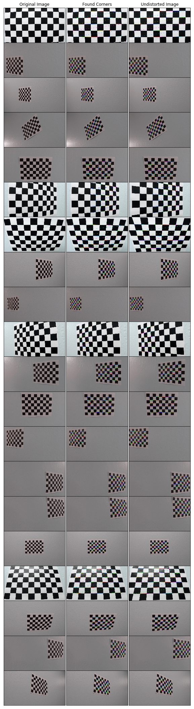
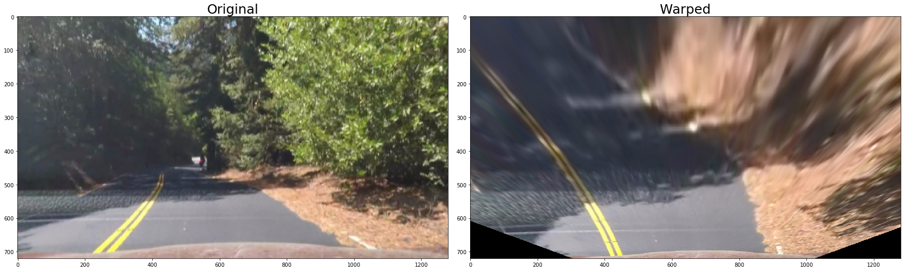
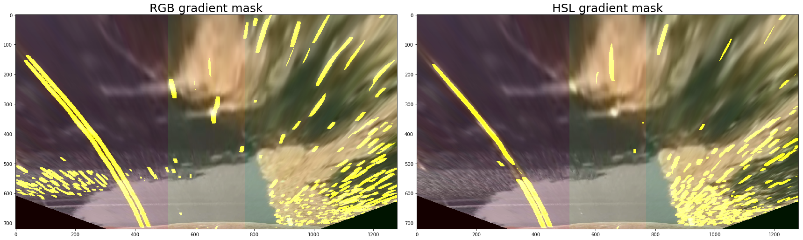
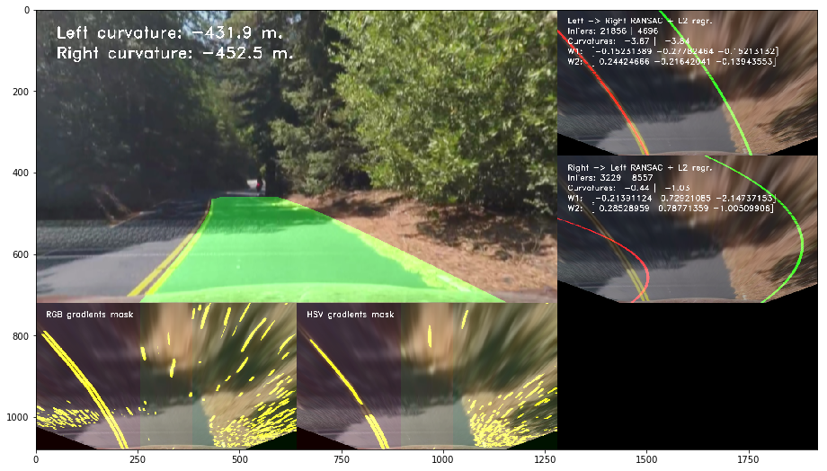

# Advanced Lane Finding Project

If we need to do it successfully then have to do below process.

* Get Camera Calibration info to process Image Undistortion.
* Use Color Transforms, Sobel Filter for Gradients.

However Color Based Thresholding is not robust.
So I'll change it to robust algorithm with non thresholding mechanism.
Currently version is very weak on Illumination problem.

* Perspective Transform to see image with "bird-eye view".
* Detect lane pixels and fit to find lane boundary.
* Estimation of Lane with RANSAC algorithm.

However RANSAC algorithm has still big problem.
Currently RANSAC use Linear Regression Analysis.
So it's weak at very big variation.
I'll change it Non Linear Regression Analysis with C.

---

## Project organization

* doit.ipynb:

This file is my final output of project.
But I feel some bad because of I failed to make more advanced algorithm.
I wanna implement Dynamic Color Conversion Matrix for making robust detection.
Anyway, this file has RANSAC algorithm with estimating the lane.

## Undistortion

We can fix distortion to undistortion image like below:

## Inverse Perspective Transform

I already describe the basic works at below link:
https://github.com/silenc3502/PyOCVLaneDetect
This is my first project that is detect lane.

We can use warpPerspective() and getPerspectiveTransform() to implement it

## Edges masks

We use Sobel Filter based Gradients.
I already discussed it's not robust.
So, I'll change it to Robust Dynamic Color Conversion mechanism.
If we use Color based thresholding then it's very weak at Illumination problem.
I can get the information at below link:
https://pdfs.semanticscholar.org/2bce/94e1f0d921d6876cf346103f5f3e121bfdd8.pdf

Anyway the results looks like below:

It's not perfect.
However I'll try above robust technique to make good.
(This Illumination problem makes Color Thresholding too bad.)

### Performance of RANSAC Algorithm

Let's check the performance of fitting algorithm.

### Details of RANSAC Algorithm and function.

Detail of class and function

1. check_consistent_length()
It's for checking arrya have consistent first dimension.
All objects in arrays must have same shape or length.
https://programtalk.com/python-examples/sklearn.utils.validation.check_consistent_length/

2. inverse_3x3_symmetric()
This function implement how to calculate inverse matrix.
This problem is comes from Linear Algebra.
And at this point, Determinant of Matrix is very important.
Generally, we called it det(Determinant of Matrix).
If A is matrix and it has inverse matrix then we can get inverse matrix with det(A) and adjoint matrix of A.
We called the adjoint matrix of A to adj(A).
and called inverse matrix of A to inv(A).
So, finally we can describe like below:inv(A) = (1 / det(A)) * adj(A).
At this function, minv variable is the result of adj(A).
And det variable is the result of det(A).
If det(A) = 0 then, there are no inverse matrix.
However if det(A) isn't zero then we can get inv(A) with above formula.
This function do this mechanism.

3. is_model_valid()
This function check the w value is alright.
It's check about distance, angle, and curvature with masking bounds.
If it's not valid then return false.
Otherwise returns ture.

4. lanes_ransac_prefit()
It's parameters are X1, y1 and n_prefits = 5000, max_trials = 500000, w_refs_left, is_valid_bounds_left.
w_refs_left and is_valid_bounds_left are zero.
However the shape is (0, 3) and (0, 3, 2).
Local variable shape will have (X1, 3) and (y1, 3).
And local variable w_prefits will have (5000, 3) shape zero data.
idxes variable is for index and it has number of X1 and y1 data with np.arange(shape[0]).
And Shuffle it with np.random.shuffle().
Sub Sampling with 4 points for _X and _y.
After Sub Sampling transpose _X to _XT and calculate Inverse matrix with inverse_3x3_symmetric().
If inverse_3x3_symmetric finished then we can get the inv(A) and it's local variable is w.
First save w to w_prefits array.
After it'll be call is_model_valid().
It' parameter is w, w_refs, and is_valid_bounds(same as is_valid_bounds_left).
Now w_prefits array have many inverse matrix data.
We can get left and right lane's prefit information with this function.

5. lane_score()
In advance, we already get the lambdas and it's very small value.
We can compute score with lambdas * n_inliers.
And if wrefs.size is bigger than zero then add wrefs(0)(0), (0)(1) and (0)(2) with exponential function.
We add e^-((w[0] - wref(0)(0))^2 / lambdas[1]^2), e^-((w[1] - wref(0)(1))^2 / lambdas[2]^2), and e^-((w[2] - wref(0)(2))^2 / lambdas[3]^2).
Finally return the score.

6. lanes_ransac_select_best()
w_left_prefits variable is the result of lanes_ransac_prefit() and it's naming is w_prefits in this function.
w_prefits has various shape because of it's processing mechanism.
First, setting best_w variable to w_prefits[0] and setting n_samples to number of data(X.shape[0]).
sample_idxs variable is the array of indices.
After initialize variable, now start loop with number of w_prefits data.
X @ w means are matrix multiplication.
We can see the information of this at the link: https://www.python.org/dev/peps/pep-0465/, https://stackoverflow.com/questions/6392739/what-does-the-at-symbol-do-in-python.
Anyway y_pred is result of X @ w.
Now we calculate error of real y and prediction of y and save the value at residuals_subset.
And we count the number of residuals_subset that is small than 0.01(this is residual_threshold).
Counting data is saved at n_inliers_subset.
And computate score to call lane_score().
It's parameter is n_inliers_subset, w, wrefs, lambdas.
After lane_score() then we get score_subset.
And if score_subset is bigger than score_best then change score_best to score_subset.
Change inlier_mask_best to inlier_mask_subset and best_w to w.
If the loop is finished then we can get the best values.

7. lane_translate()
This function's role is very simple.
First, just copy w_left1 data to w1.
And w1[0] to w1[0] + delta_left_right(this variable is same as delta).
Keep w1[1], and change w1[2] to w[2] * ( (1 + w[1]^2)^(3/2) ) / ((1 + w1[1]^2)^(3/2) - 2 * delta * w[2]).
After all operations are finish, then return the w1.
This result comes from curvature mathematical model.

8. fit()
Setting initial values like score_lambdas = [1.0, 1.0, 1.0, 1.0], stop_n_inliers = np.inf,
stop_score = np.inf, stop_probability = 0.99(99%), random_state = None.
It was already finished by constructor.
First check input parameter shape.
Setting number of minimum samples and probability to stop fitting(1 is 100% and 0 is 0%)
? residual_threshold = 0.01
Find center of left & right bounds to set delta_left_right and this case will be 0.375.
Make score_lambdas[0] to 1 / (y1.size + y2.size) and it'll be very small value.
Initialize w_fits, w_fits_l2, inliers_masks, n_inliers, score_fits values.
After initializing, doing RANSAC Pre-fitting with lanes_ransac_prefit().
(It's parameter is X1, y1 and n_prefits = 5000, max_trials = 500000, w_refs_left, is_valid_bounds_left)
w_refs_left and is_valid_bounds_left are zero.
However the shape is (0, 3) and (0, 3, 2).
After lanes_ransac_prefit(), now we have inverse matrix of each lanes.
Now, we'll call lanes_ransac_select_best() to get inliers.
(It's parameter is X1, y1, w_left_prefits, residual_threshold, w_refs_left, score_lambdas)
After finishing lanes_ransac_select_best() then we can get w_left1, in_mask_left1, score_left1.
We sum all of score_left1 and save it to n_inliers_left1.
Update w_refs to w_refs_right with reshaping best prefit datas and is_valid_bounds too.
After it, call lanes_ransac_prefit() to setting w_right_prefits.
and call lane_translate() with w_left1, delta_left_right parameter.
When lane_translate() finished then data of w0 has same curvature center.
Update w_right_prefits with w0 and w_right_prefits.
Call lanes_ransac_select_best() to get w_right1, in_mask_right1, and score_right1.
Get all results and add score_left1 with score_right1 to score_fits.
Do this process one more and check previous frame.
Finally we get best fit data and make it smoothing.
Now we doing just regression analysis and save this parameters.

9. predict_lanes()
Predict lanes from image with already saved fitting parameters.
If we run this function then have to finish fitting.

10. warp_image()
This function do Inverse Perspective Transform.

11. warped_mask_original()
It's calculate gradient with Sobel Filter.

12. default_left_right_masks()
This function return left and right lane masking area.

13. masks_to_points()
Get points from masking area.

14. lanes_to_wmask()
Draw lane with input data.

We can see the big problem about Illumination at this image.
So we need to apply above technique to solve this problem.
This noise can makes strange curve fit.

## Result

This is result of RANSAC based curve fitting.

## Future Works

I have below plan to improve this project.

1. Apply Gradient Enhancing Conversion
2. Robust Lane Detection on Various Illumination Condition
3. Apply LDA Analysis

## References

1.  https://pdfs.semanticscholar.org/2bce/94e1f0d921d6876cf346103f5f3e121bfdd8.pdf
2.  http://airccj.org/CSCP/vol5/csit53211.pdf
3.  https://github.com/balancap/SDC-Advanced-Lane-Finding
4.  https://github.com/diyjac/SDC-P4
5.  https://github.com/mvirgo/MLND-Capstone
6.  https://github.com/ab2005/carnd-advanced-line-detection
7.  https://docs.scipy.org/doc/numpy-1.13.0/reference/generated/numpy.arange.html
8.  https://datascienceschool.net/view-notebook/17608f897087478bbeac096438c716f6/
9.  https://numba.pydata.org/
10. http://pythonkim.tistory.com/95
11. https://en.wikipedia.org/wiki/Numba
12. http://numba.pydata.org/numba-doc/0.12.2/tutorial_firststeps.html
13. http://numba.pydata.org/numba-doc/0.13/ir.html
14. http://numba.pydata.org/numba-doc/dev/user/jitclass.html
15. http://numba.pydata.org/numba-doc/0.8/pythonstuff.html
16. https://www.python.org/dev/peps/pep-0465/
17. https://stackoverflow.com/questions/6392739/what-does-the-at-symbol-do-in-python
18. http://numba.pydata.org/numba-doc/0.6/doc/examples.html
19. https://docs.scipy.org/doc/numpy-1.13.0/reference/generated/numpy.vstack.html
20. http://tutorial.math.lamar.edu/Classes/CalcIII/Curvature.aspx
